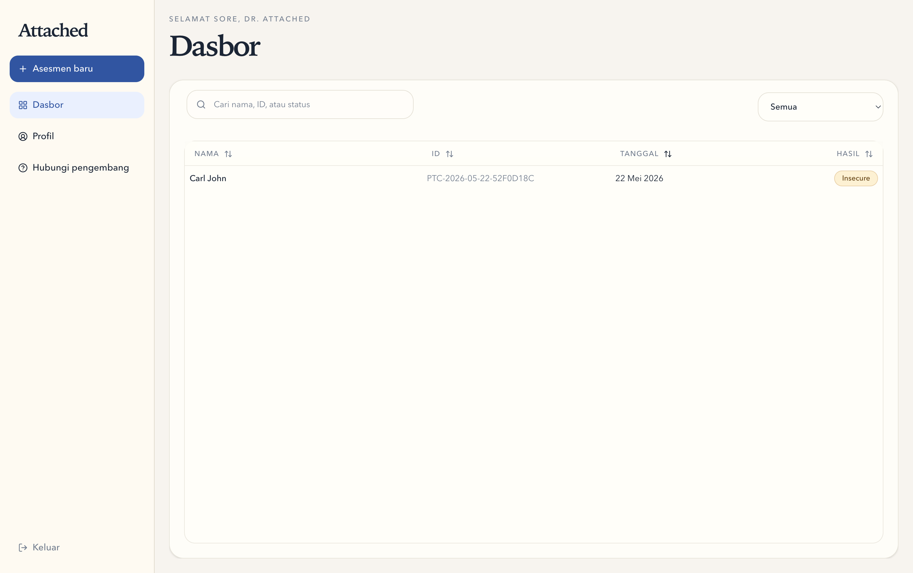
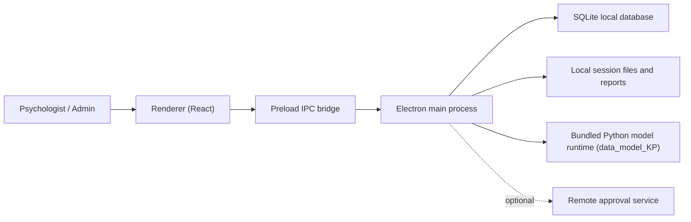

# ATTACHED

<p align="center">
  
</p>

ATTACHED is an Electron desktop application that helps psychologists conduct attachment-style assessments using a local multimodal AI pipeline.

It exists to provide a structured, local-first clinical workflow around participant intake, consent, media capture, questionnaire completion, AI inference, and clinician review without depending on a hosted patient-data backend.

> Local-first. Privacy-focused. AI-assisted clinical assessment.

Most of the current UI copy is written in Indonesian.

## What it does

ATTACHED combines a desktop UI, a local SQLite-backed backend, and a bundled Python runtime to support:

- psychologist onboarding and admin approval
- guided assessment sessions with participant identity and consent
- 14-step stimulus exposure and response capture
- a built-in 36-item ECR-RS questionnaire
- local AI inference for `secure` / `insecure` classification
- clinician review, correction, and audit-report generation

## Features

- Local multimodal attachment-style assessment
- Local-first storage and on-device inference
- Separate Admin and Psychologist roles
- Guided recording workflow for session capture
- Built-in ECR-RS questionnaire
- Confidence scores, probabilities, and clinician feedback
- Automatic audit and training-report export
- Optional remote approval sync for psychologist onboarding

## Architecture



## Tech Stack

- Electron 39
- React 19 + TypeScript
- electron-vite + Vite
- Tailwind CSS 4
- Radix UI primitives
- SQLite via `node:sqlite`
- Python model runtime in `../data_model_KP`

## Getting Started

### Requirements

- Node.js 22+
- `pnpm`
- a local `data_model_KP` runtime next to this project, or `ATTACHED_MODEL_ROOT`
- camera and microphone access on the host machine

### Install

```bash
pnpm install
```

### Run in development

```bash
pnpm dev
```

### Build

```bash
pnpm build
pnpm build:win
pnpm build:mac
pnpm build:linux
```

### Optional app config

Copy `.env.example` to `.env` if you want to configure remote approval endpoints or change debug behavior.

## Project Structure

```text
src/
|-- main/          Electron backend, SQLite, filesystem, model execution
|-- preload/       IPC bridge exposed to the renderer
|-- renderer/      React application and UI
`-- shared/        Shared contracts, constants, and IPC channels

resources/         Static assets and bundled launcher helpers
docs/              Detailed technical and operational documentation
scripts/           Helper scripts, including Electron smoke testing
```

Related external dependency:

```text
../data_model_KP
```

This sibling directory contains the Python runtime that ATTACHED uses for local inference.

## Documentation

- [Architecture](./docs/architecture.md)
- [Development Guide](./docs/development.md)
- [Environment Variables](./docs/environment.md)
- [Authentication and Approval Flow](./docs/authentication.md)
- [Runtime Contract](./docs/runtime.md)
- [Storage Layout](./docs/storage.md)
- [Privacy and Retention](./docs/privacy.md)
- [Demo Flow](./docs/demo-flow.md)

## Notes

- Only one active assessment session is allowed on a workstation at a time.
- The package and folder names still use the generic name `web`, but the product implemented here is ATTACHED.
