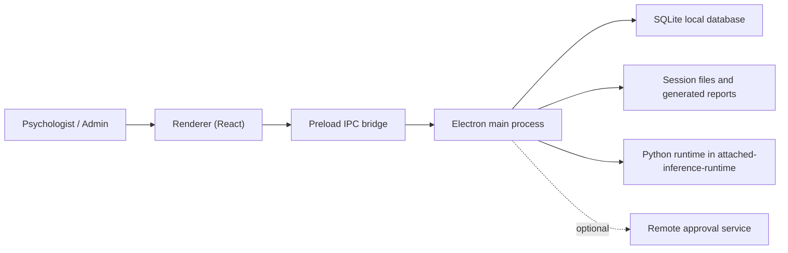

# Architecture

ATTACHED is a local-first Electron application with a React renderer, a preload IPC bridge, and a Node-based main process that owns persistence, filesystem access, and model execution.

## High-level flow

## Main layers

- `src/renderer/`
  - React screens for login, admin review, dashboard, assessment, profile, and contact flows
- `src/preload/`
  - exposes a typed `window.attached` API to the renderer
- `src/main/`
  - owns session lifecycle, SQLite access, filesystem writes, auth, and inference execution
- `src/shared/`
  - shared contracts, constants, and IPC channel names

## Backend responsibilities

The Electron main process backend is responsible for:

- local user and session persistence
- admin approval and psychologist sign-in rules
- saving capture artifacts
- generating questionnaire input for the model
- launching the local inference pipeline
- polling and reporting inference status
- storing clinician feedback
- writing audit and training-report artifacts

## Session lifecycle

The app moves sessions through these major states:

- `draft`
- `ready_for_inference`
- `running_inference`
- `completed`
- `low_confidence`
- `failed`
- `aborted`

Only one active session is allowed on a workstation at a time.

## Core assessment stages

The UI flow is organized around:

1. identity
2. consent
3. preflight
4. recording
5. questionnaire
6. review
7. running
8. result

## Key data stores

- SQLite database for users, sessions, app state, and audit events
- per-session working directories under Electron user data
- mirrored artifacts and training reports under `web/artifacts/`

See [Storage Layout](./storage.md) for the exact directory structure.
